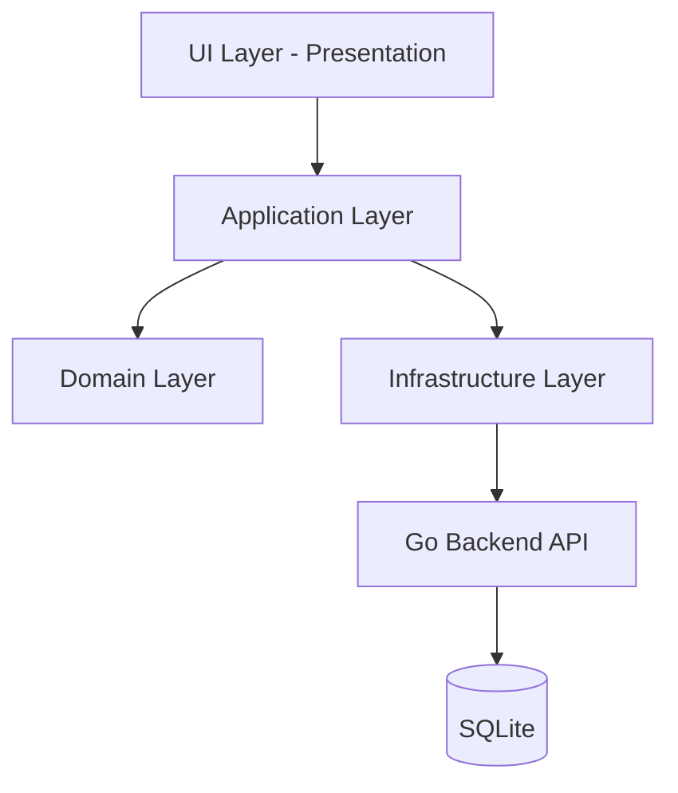
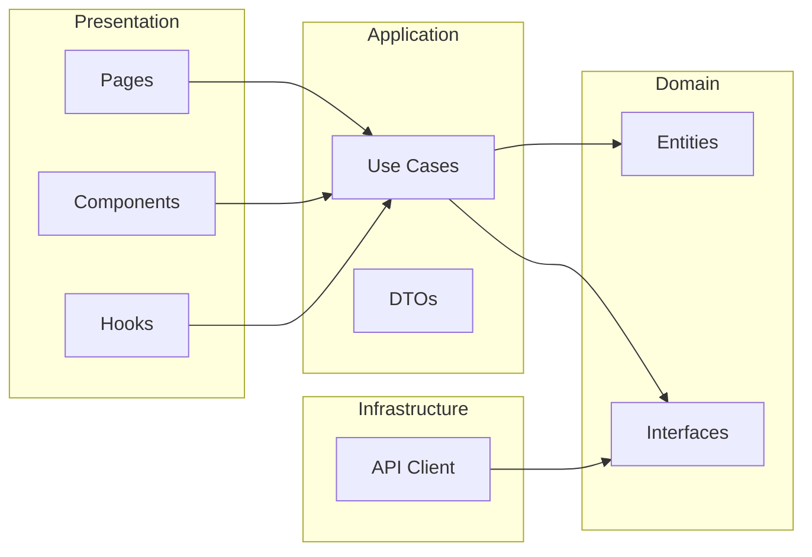
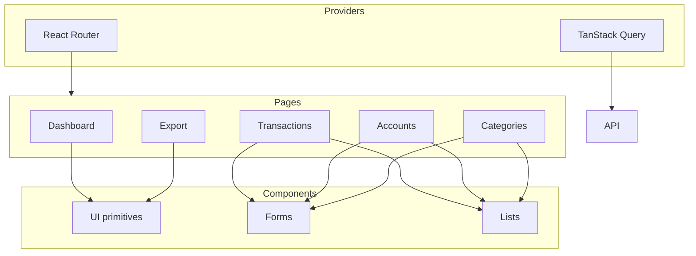
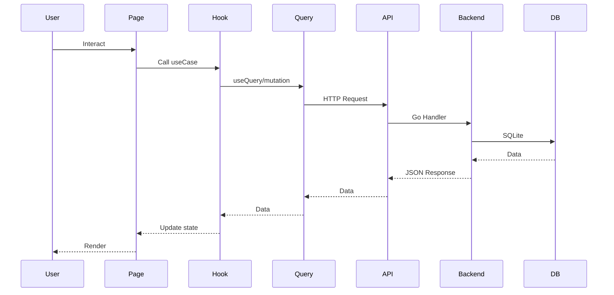

# Financial Manager

Personal finance tracking desktop application with income, expense categorization and reporting.

## Requirements

- **Frontend**: Node.js 18+, Bun
- **Backend**: Go 1.21+
- **Desktop**: Rust (for Tauri)

## Tech Stack

| Component | Technology |
|-----------|------------|
| Desktop App | Tauri |
| Frontend | React + TypeScript |
| Styling | Tailwind CSS |
| State/Data | TanStack Query |
| Backend API | Go + SQLite |

## Project Structure

```
.
├── Financial-Manager_B/     # Backend (Go + SQLite)
├── Financial-Manager_F/     # Frontend (Tauri + React)
├── src-tauri/              # Tauri Rust backend
└── src/                    # React frontend
    ├── domain/              # Entities, interfaces
    ├── infrastructure/      # API client
    └── presentation/       # UI components, pages
```

## Getting Started

### Frontend

```bash
# Install dependencies
bun install

# Run in development mode
bun tauri dev

# Build for production
bun tauri build
```

### Backend (required for production)

The frontend connects to the backend API at `http://localhost:8080`.

See [Financial-Manager_B](../Financial-Manager_B/) for backend setup.

## Available Commands

| Command | Description |
|---------|-------------|
| `bun tauri dev` | Run app in development mode |
| `bun tauri build` | Build production executable |
| `bun tauri build --debug` | Build with debug symbols |

## API Endpoints

The frontend consumes the following API endpoints:

| Method | Endpoint | Description |
|--------|----------|-------------|
| GET | `/api/v1/dashboard` | Dashboard summary |
| GET | `/api/v1/accounts` | List accounts |
| POST | `/api/v1/accounts` | Create account |
| GET | `/api/v1/categories` | List categories |
| POST | `/api/v1/categories` | Create category |
| GET | `/api/v1/transactions/incomes` | List income transactions |
| GET | `/api/v1/transactions/expenses` | List expense transactions |
| POST | `/api/v1/transactions/incomes` | Create income |
| POST | `/api/v1/transactions/expenses` | Create expense |
| GET | `/api/v1/export/csv` | Export to CSV |
| GET | `/api/v1/export/json` | Export to JSON |

## Architecture

The frontend follows Clean Architecture principles:



### Layer Dependencies



### Component Overview



### Data Flow



```
src/
├── domain/           # Business entities and interfaces
│   ├── entities/     # Transaction, Account, Category
│   └── repositories/# Interface definitions
├── application/     # Use cases (future)
├── infrastructure/  # External services
│   └── api/         # HTTP client
└── presentation/    # UI layer
    ├── components/  # Reusable UI components
    ├── pages/      # Screen components
    ├── hooks/      # Custom hooks
    └── providers/  # Context providers
```

## License

[GPL-3.0](./LICENSE)
